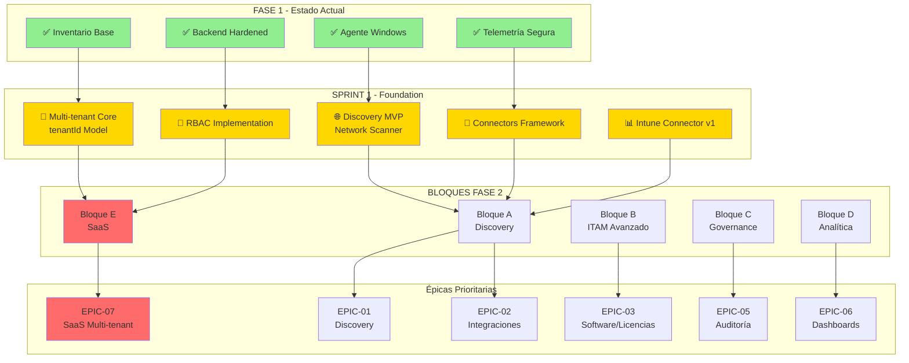

# Diagrama 01: Roadmap Fase 1 → Fase 2

**Propósito**: Mostrar el flujo de evolución del proyecto  
**Formato**: Mermaid (ver en GitHub / convertir a PNG con mermaid-cli)

---

## 📊 Mermaid Source



---

## 🖼️ Exportar a PNG

Para convertir a imagen PNG:

```bash
# Requiere: npm install -g @mermaid-js/mermaid-cli

mmdc -i Diagramas/01_roadmap-arquitectura.md -o Diagramas/01_roadmap-arquitectura.png

# O usar online editor:
# https://mermaid.live → copiar source → export PNG
```

---

## 📝 Explicación

- **Verde (Fase 1)**: Ya completado, funcional
- **Amarillo (Sprint 1)**: Foundation de Fase 2 (tareas inmediatas)
- **Naranja (Bloques)**: Organización de trabajo
- **Rojo (Épicas)**: Resultados finales de Fase 2

El flujo muestra cómo cada componente de Fase 1 se extiende en Sprint 1 y luego se desdobla en los 5 bloques de Fase 2.
