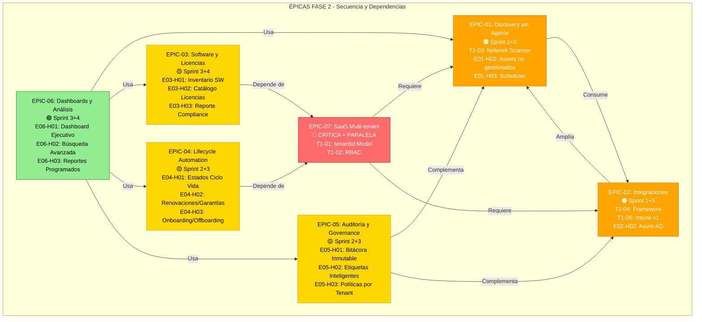

# Diagrama 02: Épicas Fase 2 - Secuencia e Impacto

**Propósito**: Mostrar dependencias y orden de implementación de épicas  
**Formato**: Mermaid Graph

---

## 📊 Mermaid Source



---

## 📝 Leyenda

| Color | Prioridad | Sprint | Descripción |
|-------|----------|--------|-------------|
| 🔴 Rojo | CRÍTICA | 1-4 | SaaS Multi-tenant (foundation absoluta) |
| 🟠 Naranja | ALTA | 1-3 | Discovery + Integraciones (cobertura rápida) |
| 🟡 Amarillo | MEDIA | 2-4 | ITAM, Lifecycle, Auditoría, Dashboards |
| 🟢 Verde | SOPORTE | 3-4 | Dashboards ejecutivos (dependen del resto) |

---

## 🔀 Flujo de Dependencias

1. **EPIC-07 de soporta TODAS las otras** (multi-tenant es la base)
2. **EPIC-01 + EPIC-02** pueden hacerse en paralelo (discovery + integraciones)
3. **EPIC-04 + EPIC-05** dependen de EPIC-07, pueden hacerse paralelas
4. **EPIC-03 + EPIC-06** dependen del resto, se hacen al final

---

## 🖼️ Exportar a PNG

```bash
mmdc -i Diagramas/02_epicas-secuencia.md -o Diagramas/02_epicas-secuencia.png
```
