# Diagrama 03: Timeline Fase 2 - 12-16 Semanas

**Propósito**: Mostrar timeline sprint-by-sprint  
**Formato**: Mermaid Timeline

---

## 📊 Mermaid Source

```mermaid
timeline
    title Fase 2 - Timeline de Ejecución (12-16 semanas)
    
    section Pre-Fase2
        23 mar : Análisis y organización
        24 mar : Kickoff oficial
        
    section Sprint 1 (Semana 1-2)
        24-27 mar : T1-01: Multi-tenant
        24-27 mar : T1-02: RBAC
        24-27 mar : T1-03: Discovery MVP
        30-03 apr : T1-04: Framework Connectors
        30-03 apr : T1-05: Intune Connector
        03 apr : Sprint 1 Review + Demo
        
    section Sprint 2 (Semana 3-4)
        06 apr : EPIC-01 Discovery H2 (Assets no gestionados)
        06 apr : EPIC-05 H01 (Bitácora Inmutable)
        06 apr : EPIC-04 H01 (Ciclo Vida Automation)
        17 apr : Sprint 2 Review
        
    section Sprint 3 (Semana 5-6)
        20 apr : EPIC-02 H02 (Azure AD Connector)
        20 apr : EPIC-03 H01 (Inventario Software)
        20 apr : EPIC-06 H02 (Busqueda Avanzada)
        01 may : Sprint 3 Review
        
    section Sprint 4-5 (Semana 7-10)
        04 may : EPIC-03 H02 (Catálogo Licencias)
        04 may : EPIC-04 H02 (Renovaciones)
        04 may : EPIC-06 H01 (Dashboard Ejecutivo)
        29 may : Sprint 4-5 Reviews
        
    section Sprint 6-7 (Semana 11-14)
        01 jun : EPIC-05 H02 (Etiquetas Inteligentes)
        01 jun : EPIC-06 H03 (Reportes Programados)
        01 jun : Hardening + Security Tests
        26 jun : Sprint 6-7 Reviews
        
    section Sprint 8 (Semana 15-16)
        29 jun : Polish + Documentación Final
        29 jun : Capacitación del Equipo Operativo
        12 jul : Fase 2 Release Candidate
        
    section Post-Fase2
        19 jul : Go-live Fase 2
        26 jul : Post-launch metrics + iteraciones
```



---

## 📅 Hitos Principales

| Fecha | Evento | Duración |
|-------|--------|----------|
| **23/03** | Análisis completo | 1 día |
| **24/03** | Kickoff Fase 2 | 1 día |
| **03/04** | Sprint 1 Review | Final de semana 2 |
| **17/04** | Sprint 2 Review | Final de semana 4 |
| **12/07** | Release Candidate | 16 semanas |
| **19/07** | Go-live Fase 2 | ~17 semanas |

---

## 🎯 Bloques del Timeline

### Sprints Iniciales (1-2)
- **Focus**: Foundation multi-tenant + Discovery MVP
- **Risk**: Bajo (están bien definidas)
- **Dependency**: Mínimas en infrastructure

### Sprints Medieros (3-5)
- **Focus**: Integraciones + ITAM completo
- **Risk**: Medio (APIs externas)
- **Dependency**: Foundation completada

### Sprints Finales (6-8)
- **Focus**: Dashboards, reportes, hardening
- **Risk**: Bajo (basado en el resto)
- **Dependency**: Todo anterior completado

---

## 🖼️ Exportar a PNG

```bash
mmdc -i Diagramas/03_timeline-12semanas.md -o Diagramas/03_timeline-12semanas.png
```
