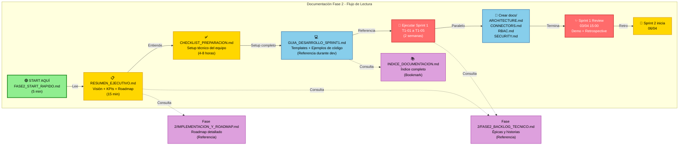

# Diagrama 04: Flujo de Documentación y Lectura

**Propósito**: Mostrar cómo navegar toda la documentación generada  
**Formato**: Mermaid Graph (Flow)

---

## 📊 Mermaid Source



---

## 📍 Puntos Clave del Flujo

1. **Verde (START)**: Punto de entrada único
2. **Amarillo (Planning)**: Entiende visión y prepárate
3. **Azul (Ejecución)**: Desarrolla usando templates
4. **Rojo (Sprint)**: Demo y cierre
5. **Puntedas (Referencia)**: Consulta según sea necesario

---

## 🔀 Flujos Alternativos

### Si eres Developer
```
START → RESUMEN_EJECUTIVO (15 min) 
      → CHECKLIST_PREPARACION (4h) 
      → GUIA_DESARROLLO_SPRINT1 (referencia)
      → Ejecutar T1-XX
```

### Si eres Tech Lead
```
START → RESUMEN_EJECUTIVO (30 min - validate vision)
      → INDICE_DOCUMENTACION (tabla de contenidos)
      → BACKLOG_TECNICO (épicas)
      → Plan timeline y equipo
```

### Si eres PM
```
START → RESUMEN_EJECUTIVO (30 min)
      → IMPLEMENTACION_Y_ROADMAP (competitive analysis)
      → KPIs y tracking
      → Jira setup (ver Integraciones/)
```

---

## 🖼️ Exportar a PNG

```bash
mmdc -i Diagramas/04_flujo-documentacion.md -o Diagramas/04_flujo-documentacion.png
```

---

## 💡 Cómo Usar Este Diagrama

**En el Kickoff (24/03)**:
- Presentar este diagrama
- Mostrar camino específico según rol
- Dar los links correctos a cada persona

**Durante la ejecución**:
- Referencia visual de dónde estamos
- Guía para onboarding de nuevos team members
- Validación de que estamos en el camino correcto
